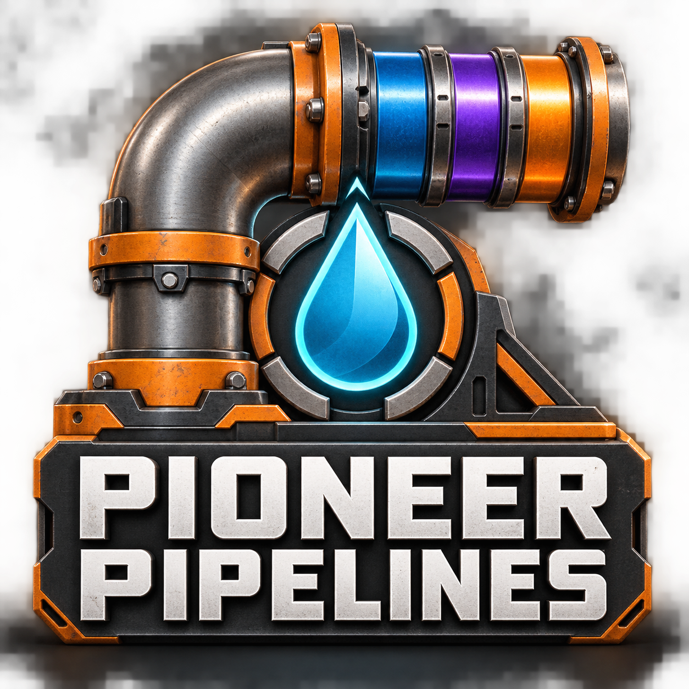
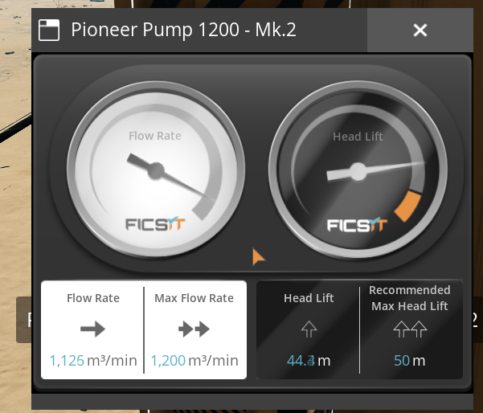
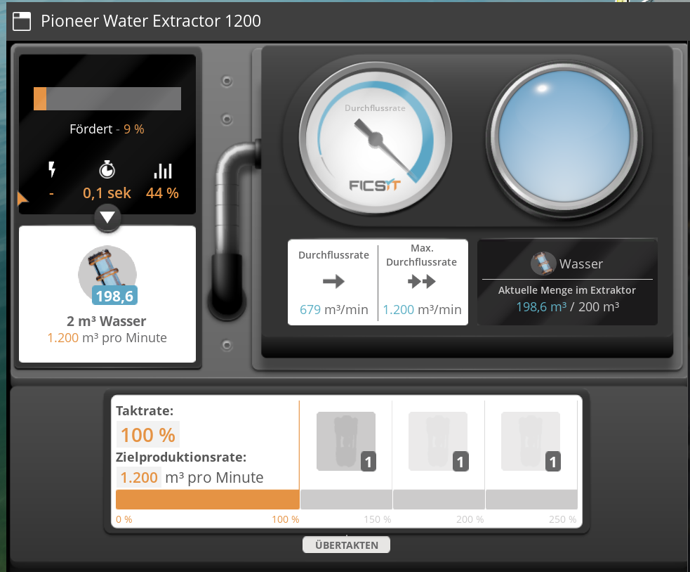
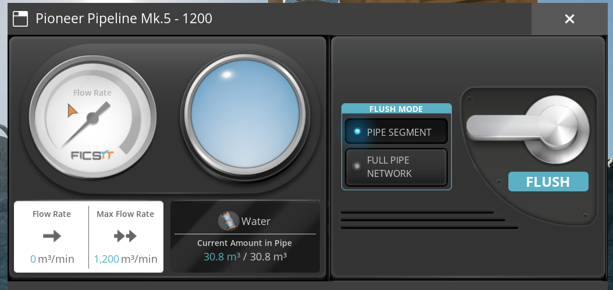

# Pioneer Pipelines

**Meh Durchfluss. Vertrauts Baue.**

Pioneer Pipelines ergänzt Satisfactory um Rohre mit 750, 900 und 1200 m³/min, passendi Pumpe, es regelbars Ventil, e Rohrchrüzig und en eigene 1200er-Wasserextraktor.

## Inhalt

| Bauteil | Kapazität / Förderhöchi |
|---|---|
| Pipeline Mk.3 | 750 m³/min |
| Pipeline Mk.4 | 900 m³/min |
| Pipeline Mk.5 | 1200 m³/min |
| Pumpe Mk.1 | 1200 m³/min · 20 m |
| Pumpe Mk.2 | 1200 m³/min · 50 m |
| Ventil | 0–1200 m³/min |
| Rohrchrüzig | 1200 m³/min |
| Wasserextraktor | 1200 m³/min bi 100 % |

## So funktioniert’s

Die Zahle sind Kapazitätsgränze. De tatsächlich Durchfluss hängt vo de Quelle, em Verbrauch, de Rohrfüllig, de Förderhöchi und de übrige Bauteil ab. Es 1200er-Rohr erzeugt sälber kei Flüssigkeit. Pumpe behalted d’Vanilla-Förderhöchi vo 20 beziehungsweise 50 Meter. Für de volle Pumpedurchfluss müend d’beide angränzende Rohre gnueg Kapazität ha.

S’Ventil erlaubt Istellig bis 1200 m³/min; bi 0 isch es zue. Chliini Schwankige vo de Durchflussazeig sind möglich. Bi de Test isch zum Biispiel bi ere 600er-Istellig rund 604,7 azeigt worde.

## Freischalte

Im HUB uf Tier 6 git’s zwei reguläri Meilestei:

- **Pioneer Pipelines - Advanced Fluid Transport:** alli drei Rohrstufe, beidi Pumpe, Ventil und Chrüzig.
- **Pioneer Water Extractor 1200:** de Wasserextraktor.

D’Köschte sind aktuell us de Vanilla-Mk.2-Vorlag übernoh. Wandhalterige und ander Vanilla-Zuebehör sind separati Freischaltige.

## Installation und Multiplayer

Installier s’veröffentlichte Modpaket über de Satisfactory Mod Manager, sobald es verfüegbar isch. Für Multiplayer bruuched alli Clients und de Server dieselbi Modversion. En Linux-Dedicated-Server isch im bisherige Teststand erfolgreich testet worde.

S’Quellpaket ersetzt kei fertig bauts Modpaket. Für de Release müend de Windows-Client und de Linux-Server mit Alpakit paketiert werde.

## Bilder us em Spiel

### Pumpe Mk.2

### Wasserextraktor

### Pipeline Mk.5

D’Screenshots zeiged Momentufnahme; sie sind kei Messprotokoll für en konstante Durchfluss.

## Stand und Gränze

Aktuell: **1.0.0-rc.2**, no kei endgültige Release. Durchfluss, Pumpeanimatione, Ventilfunktion, Speichere/Lade und Linux-Server sind im bisherige Stand testet. D’neui Stilllegig vo de Test-Sink muess no im Spiel überprüeft werde. D’Meldig zur Wandmontage isch no offe.

D’Test-Sink ghört nöd zum spielbare Modinhalt. Ihr Baurezäpt isch deaktiviert und sie vernichtet kei Flüssigkeit meh. Alti Testobjekt blibed zum Lade vo bestehende Saves technisch erhalte und chönd abbaut werde.

Kompatibilität mit andere Mods isch nöd pauschal garantiert. Pumpe und Rohre vo andere Mods werded nöd automatisch uf 1200 umgstellt.

## Problem melde

Bitte Modversion, Spielversion, Einzelspieler oder Server, betroffeni Bauteil und Schritt zum Nachstelle aageh. Es Bild und s’FactoryGame.log helfed. Bi Durchflussproblem au Quelle, Abnahm, Förderhöchi und Ventilistellig nenne.

## Credits

Mod vo **Doesewicht**. Satisfactory und d’Spielassets ghöred Coffee Stain Studios. Inoffizielli Mod, nöd vo Coffee Stain unterstützt. S’Logo und d’Illustratione sind KI-unterstützt erstellt; d’Spielbilder sind Screenshots. D’Illustratione stelle kei neue 3D-Modelle im Spiel in Ussicht.

<!-- Vor em Iifüege im Modportal: Bilder det ufelade und d’relative Bildpfäd durch die Bild-URLs ersetze. -->
