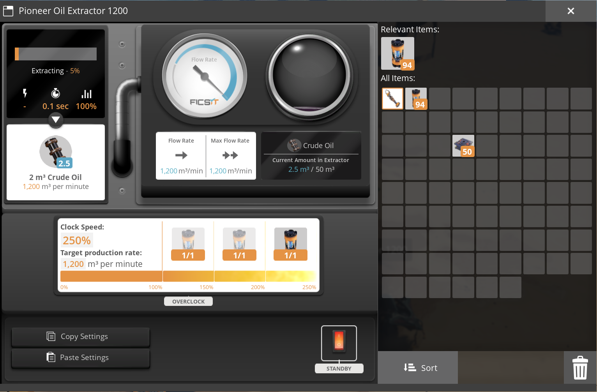
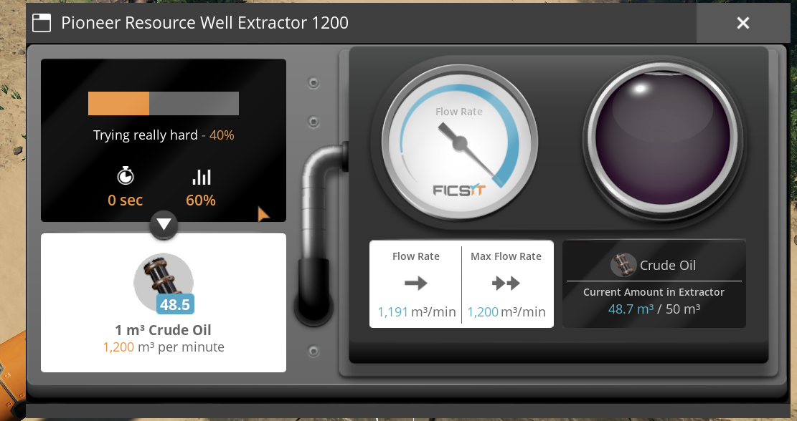
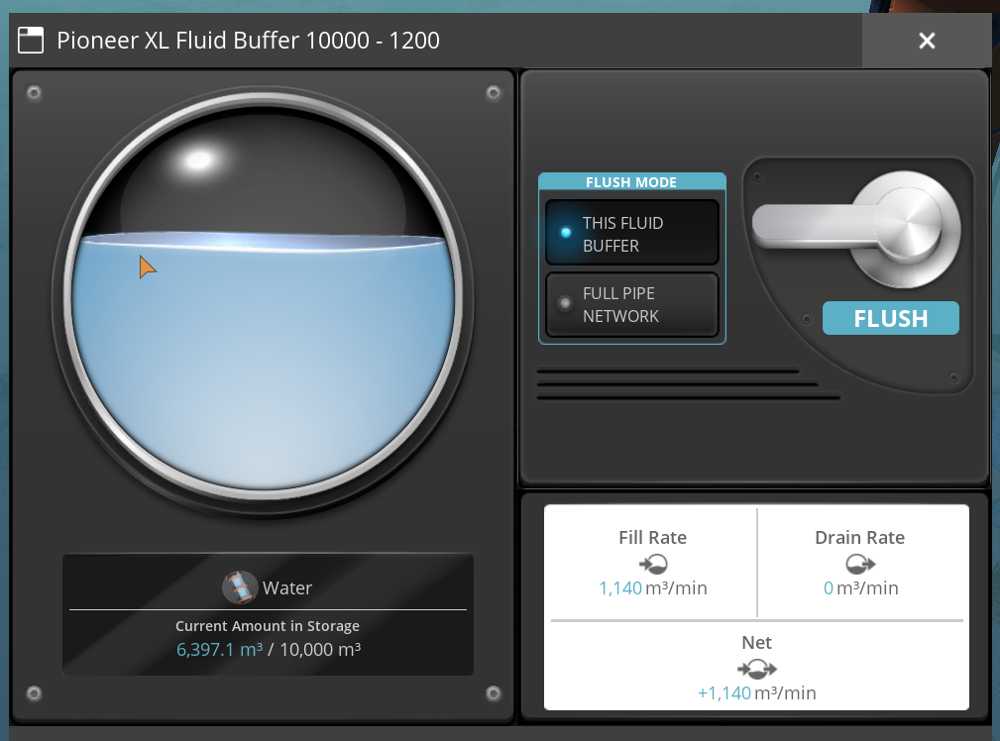
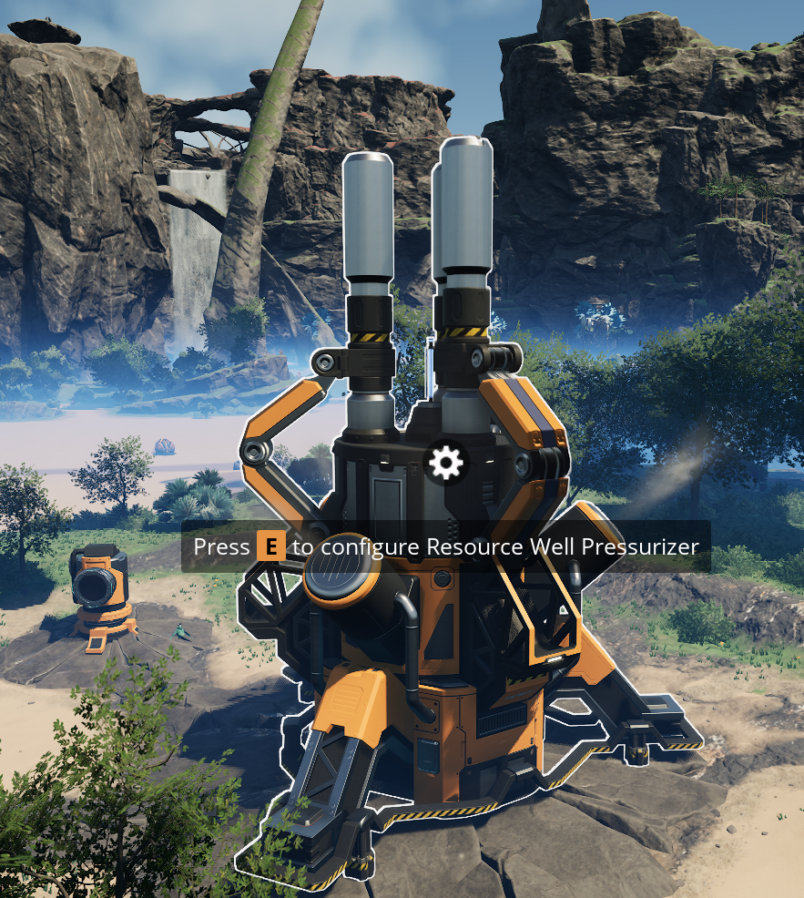
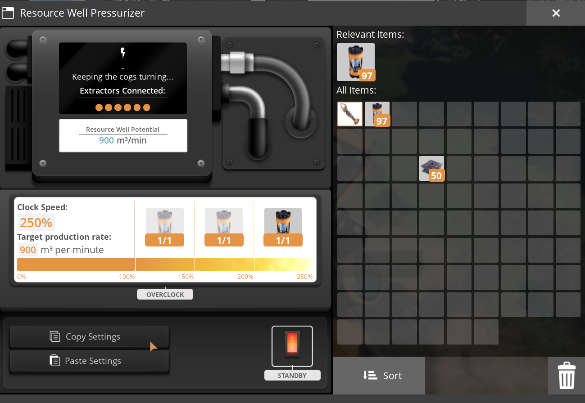

# Pioneer Pipelines

**More flow. Familiar building. — Version 1.1.0**

Expand your Satisfactory fluid network with pipelines up to 1,200 m³/min, matching pumps, an adjustable valve, junctions, fluid buffers and enhanced extractors.

## Buildings

| Building | Capacity / specification |
|---|---|
| Pipeline Mk.3 | 750 m³/min |
| Pipeline Mk.4 | 900 m³/min |
| Pipeline Mk.5 | 1,200 m³/min |
| Pump Mk.1 | 1,200 m³/min; 20 m recommended head lift |
| Pump Mk.2 | 1,200 m³/min; 50 m recommended head lift |
| Valve | Adjustable 0–1,200 m³/min; zero closes the valve |
| T-Junction and Cross Junction | Support 1,200 m³/min connections |
| Fluid Buffer | Vanilla small-buffer storage; 1,200 m³/min per connection |
| Industrial Fluid Buffer | Vanilla industrial-buffer storage; 1,200 m³/min per connection |
| XL Fluid Buffer | 10,000 m³ storage; 1,200 m³/min per connection |
| Water Extractor | 1,200 m³/min at 100% clock speed |
| Oil Extractor | Up to 1,200 m³/min on a pure node at 250% |
| Resource Well Extractor | Up to 1,200 m³/min on a pure satellite at 250% |

## Oil and resource well extraction

| Purity | At 100% clock | At 250% clock |
|---|---:|---:|
| Impure | 120 m³/min | 300 m³/min |
| Normal | 240 m³/min | 600 m³/min |
| Pure | 480 m³/min | 1,200 m³/min |

The oil extractor doubles vanilla extraction, base power consumption and construction materials. The resource well extractor quadruples vanilla extraction and construction materials. The standard pressurizer still controls activation and clock speed; its power consumption is unchanged.

**Known display limitation:** the standard Resource Well Pressurizer potential display does not account for the increased Pioneer extractor output. Check the individual Pioneer extractor for its production and flow values.

## Unlocks

Two milestones are available in HUB Tier 6:

- **Pioneer Pipelines - Advanced Fluid Transport:** pipelines, pumps, valve, both junctions, three buffers, oil extractor and resource well extractor.
- **Pioneer Water Extractor 1200:** the water extractor.

Eligible existing saves receive the new recipes when loaded. Vanilla wall supports and other accessories retain their own unlocks.

## Flow and compatibility

Capacity is not a guarantee of sustained throughput. Supply, demand, pipe fill, head lift and other bottlenecks still matter. Pipes and buffers do not generate fluid. Pump head lift remains at the vanilla 20 m / 50 m values.

The internal test sink is not playable release content. Its build recipe and fluid disposal behavior are disabled; legacy objects remain loadable for save compatibility.

Satisfactory Plus pipeline-limit fixes are included. Compatibility with every mod combination is not guaranteed, and other mods’ buildings are not automatically upgraded.

## Installation and multiplayer

Use the published mod package through Satisfactory Mod Manager. All clients and the server must use the same mod version. Linux dedicated-server operation and the final extraction/save-reload checks were confirmed by the author during testing.

This repository's documentation is separate from the compiled mod package. A source archive must be built and packaged with Alpakit before installation.

## Screenshots

Screenshots show individual moments, not sustained-throughput benchmarks.

### Pioneer Oil Extractor 1200

Oil extractor at 250% clock speed, showing 1,200 m³/min target production and flow.

### Pioneer Resource Well Extractor 1200

Resource well extractor showing a 1,200 m³/min production target and 1,191 m³/min instantaneous flow.

### Pioneer Water Extractor 1200

Water extractor with a 1,200 m³/min production target at 100% clock speed.

### Pioneer Pump 1200 — Mk.2

Pump Mk.2 with 1,200 m³/min maximum flow and 50 m recommended head lift.

### Pioneer XL Fluid Buffer

XL buffer with 10,000 m³ storage, showing a snapshot of its fill rate and stored water.

### Standard Resource Well Pressurizer

The unchanged vanilla pressurizer activates the resource well and controls extractor clock speed. This is not an additional Pioneer building.

### Standard pressurizer — display limitation

The vanilla pressurizer still shows 900 m³/min potential in this setup. Its display does not account for enhanced Pioneer output; check the individual Pioneer extractor instead.

### Pioneer Pipeline Mk.5

## Support

Report the mod version, game version, single-player or server setup, affected buildings and reproduction steps. Include FactoryGame.log and, for flow issues, supply, consumption, head lift and valve settings.

## Credits and AI transparency

Created by **Doesewicht**. This is an unofficial Satisfactory mod, not endorsed by Coffee Stain Studios. Satisfactory and its game assets belong to their respective owners. The logo and illustrations were created with AI assistance; gameplay images are screenshots. Illustrations do not represent new in-game 3D models.
